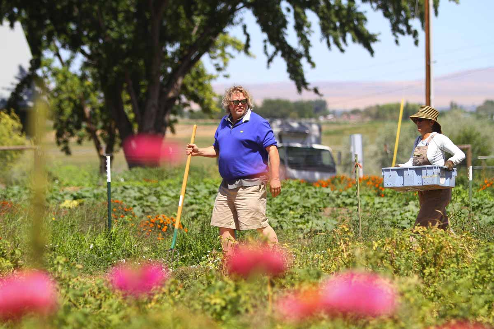
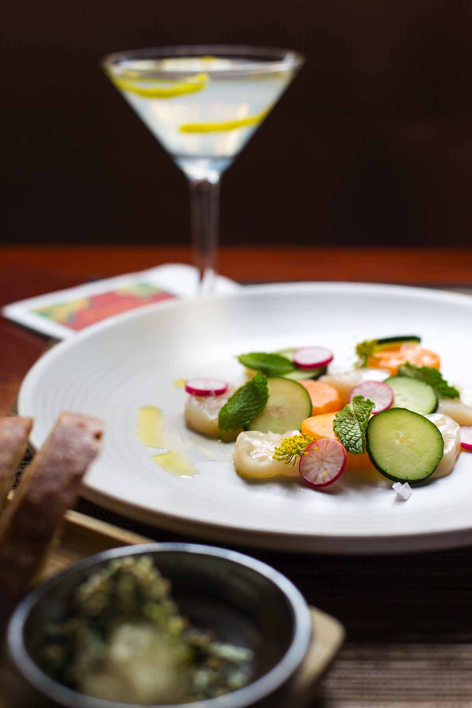
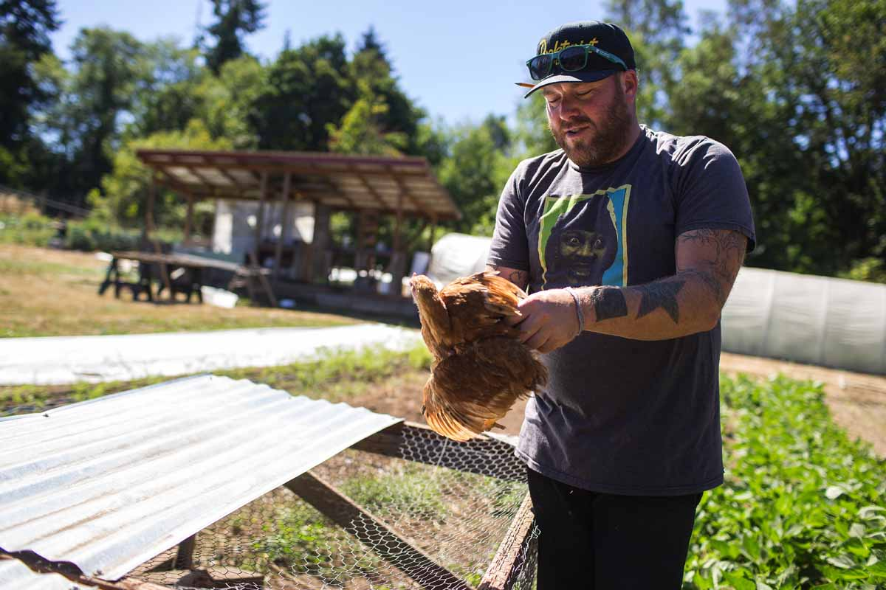
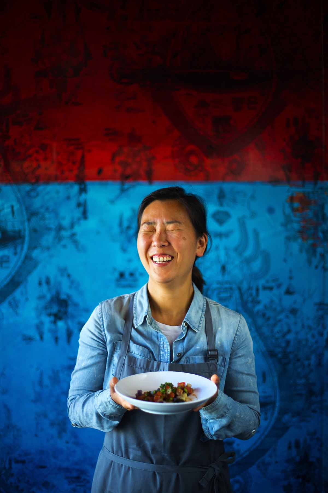
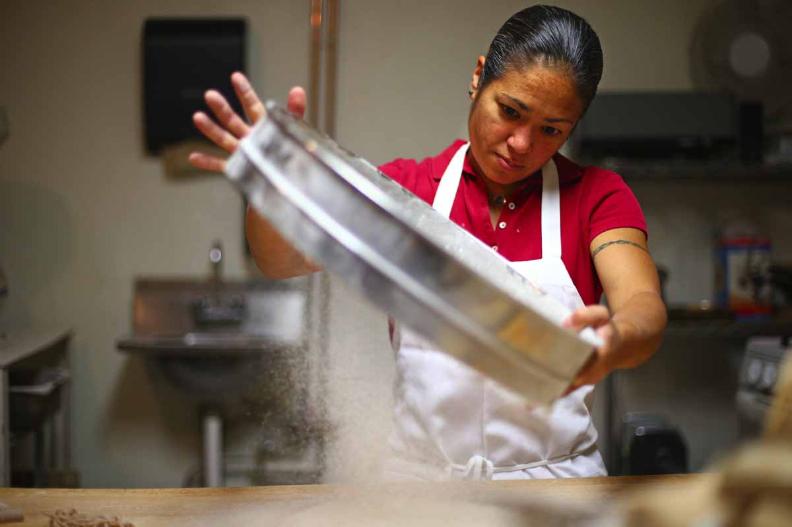
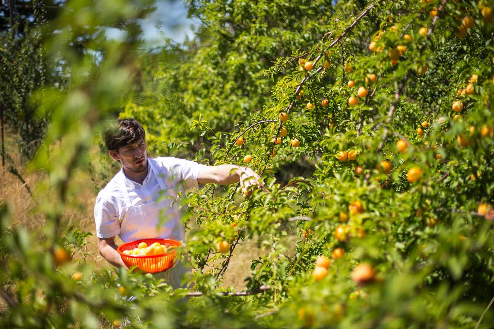
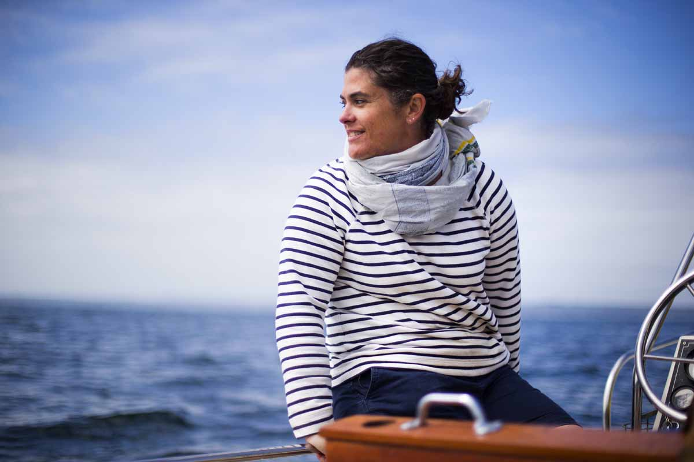
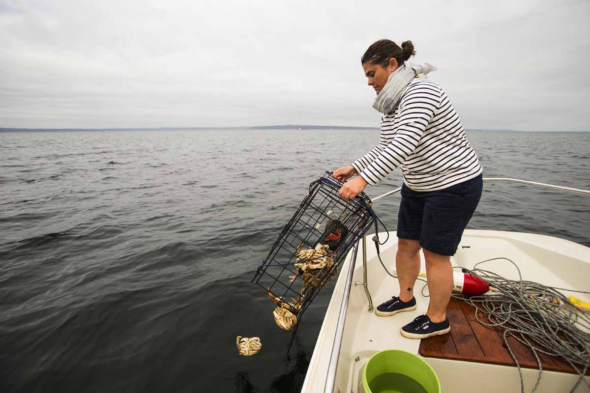

*At his old chaser farm* on Vashon Island, Matt Dillon reaches over a wire fence to scratch one of his pigs on the head. "If I fell down in there, he'd eat me," Dillon says affectionately.

Renee Erickson bangs her little Boston Whaler into the back of a sailboat while maneuvering out of her slip at Shilshole Bay Marina. She curses lightly. Two crab pots baited with sockeye salmon heads, the flesh brilliantly crimson, await her attention.

Among the moss-muffled firs near Hood Canal, Jeremy Faber sets out in search of the black trumpet mushrooms that carpet the forest floor. "I have to pick for an hour a day," he says, "otherwise I'll go crazy."

Maria Hines pours organic wheat harvested from golden fields on the Olympic Peninsula into a noisy mill in a kitchen in Fremont, a dust of fine flour particles coating the room.

On lush Lummi Island, Blaine Wetzel walks down a wooded path to Sunset Beach, where he'll gather succulents growing among the piled driftwood and stones.

<aside class="inset related">
  

    Read more about the chefs featured in this series:
  

  <ul>
    <%= t.include("_chef-sidebar.html") %>
  </ul>
</aside>

The foods our chefs have to work with are unparalleled. A live Dungeness crab, dropped into boiling water with a whispered apology, has sweeter, more tender meat than any soft-shell crab, any lobster. Spot prawns put other shrimp to shame, they taste so fresh and floral. A plate of our oysters on the half-shell on a dark winter's night: Each one rings like a bell. Geoduck is coveted worldwide for its barely briny bounce; razor clams are our own secret prize. Salmon, barely seared or smoked or cured, is our king. Out in the forest, nettles are the enemy of the epidermis, friend of the stomach; the mushrooms are magic — morels, porcini, chanterelles — just there for the taking. Wild native trailing blackberries await, smaller, sweeter and less seedy than the fat, glossy Himalayan ones that sprawl along freeway onramps. Asparagus comes as a springtime gift from east of the mountains. Summer brings ridiculously drippy peaches. The world's most back-to-school smell is Washington apple juice pouring from a wooden press.

<aside class="image wide">
  
  
Tom Douglas and his wife, Jackie Cross, gather produce at Prosser Farm. (John Lok / The Seattle Times)

</aside>  

<aside class="image right">
  
  
Alaskan weather-vane scallop with Prosser Farm cucumber and melon at Tom Douglas’ Dahlia Lounge. (John Lok / The Seattle Times)

</aside>  

"Farm-to-table" has been repeated into preciousness, headlining news releases and printed in faux-letterpress type onto countless menus across the land. But for Seattle's award-winning chefs, the farm is neither gimmick nor abstraction. Even [local mogul Tom Douglas](http://www.seattletimes.com/life/food-drink/out-on-the-farm-with-tom-douglas-and-jackie-cross/), with a dozen-plus restaurants and counting, has Prosser Farm: Three hours southeast of the city, it's helmed with joy and frustration and sweat by his wife, Jackie Cross, who actually wears overalls. Likewise, fishing and foraging in the Pacific Northwest aren't lifestyle choices, but part of lives, learned early and held dear.

If you're a newcomer here and you love food, you've been startled by what our chefs have fed you — by its aching freshness, by its reverent treatment, by its pure goodness. At its best, isn't this better eating than anywhere in the world? If you've been here all along, hearing the stories and eating the food, with increasing elation — watching things grow — you have the answer to that question, and it's a quiet but certain one.

It's not just farm-to-table, forest-to-table or boat-to-table here. What you find in front of you at Seattle's best restaurants tastes so very, very good because it's life-to-life: from the lives of these chefs, and the lives of their hardworking suppliers, to yours. This is the cuisine of the Pacific Northwest: ineffable yet specific to this place, both influenced by and influencing those who are lured here by its plenty — or who've been fortunate enough to be here all along.

<!-- no need for hr when gallery is full width -->
<aside class="full-width gallery-container">
  <%= t.include("_gallery.html") %>
</aside>

<aside class="inset ad-float">
  <%= t.include("partials/_ad.html", { type: "right" }) %>
</aside>

[*James Beard*](http://www.jamesbeard.org/), one of America's preeminent food writers, grew up in Portland. He left the Pacific Northwest behind, but he did look back — waxing nostalgic about gathering wild huckleberries, reminiscing about summers spent on the coast eating Dungeness crab ("the Pacific's greatest blessing") and razor clams (&#8220;superb ... cooked as simply as possible in order to savor their natural goodness").

He knew and loved our coastline from down past Tillamook, in his home state, up to Grays Harbor. But, Beard wrote of the region in 1983, "During my long lifetime ... there has never been a restaurant that glorified the great gifts from the sea, nor the fine vegetables, or the wild mushrooms, or the small fruits or the game." He celebrated the existence of proto-locavore Washington coast restaurant the Ark as a thrilling beginning: "People have learned more about cooking, they have learned more about eating. They are more discriminating. This offered (the Ark) an opportunity to revel in some of the goodies, not only the fish but the chanterelle and the other wild mushrooms and the vegetables that abound ... and have a quality that one seldom finds anywhere else."

Thus, Beard wrote, "There was new imagination. There was new creativity. There was variety and there was goodness."

Just a few years later, Jerry Traunfeld arrived in Seattle to find a regional cuisine just getting under way. He'd come from San Francisco, where Alice Waters had made a movement out of letting excellent ingredients speak for themselves; he'd been working for the prescient Jeremiah Tower at the storied restaurant Stars.

"When I started cooking here in '86, there wasn't much," he says, laughing. "We had a little media thing with a bunch of local chefs about ‘Is there a Northwest cuisine?' "

He would become part of the answer to that question. When he precipitously became executive chef at the Alexis — after "all the other cooks left" — he inherited the suppliers of chef Bruce Naftaly (who went on to run French marvel [Le Gourmand](http://www.legourmandrestaurant.com/home.html)). "He was buying cheese from Sally Jackson, and he was hooked up with farmers on Vashon Island who were growing this wonderful salad mix with like 30 different things in it, and all the different weird herbs," Traunfeld says. "I didn't really grasp exactly what he had done."

Traunfeld became the chef of [The Herbfarm](http://www.theherbfarm.com/), which during his tenure became the premier dining experience in the Northwest. When it comes to our regional cuisine, Traunfeld says, "If any restaurant defines it, it's The Herbfarm ... We would use things like lemons and chocolate, but other than that, we were very strict about trying to be as local as possible."

<aside class="image wide">
  
  
Matt Dillon holds one of his Freedom Ranger chickens at Old Chaser Farm on Vashon Island. (John Lok / The Seattle Times)

</aside> 

In the early '90s, Matt Dillon got his hands on one of Traunfeld's menus from The Herbfarm, the thematically dedicated "A Menu for a Copper King." It listed, Dillon says, "things like Douglas fir, ingredients that you didn't see very often. I immediately thought to myself, ‘Wow, I want to work there.' " Eventually, he did, and he credits both Traunfeld and Herbfarm owner Ron Zimmerman with showing him what "the landscape looked like through someone's eyes who was truly hungry, in Washington — like, what can I make to fill myself here, and also be artistically truly creative?" He now calls it "eyes-wide-open stuff" — his first experience in "what you would try to define as Pacific Northwest cuisine."

Dillon opened the tiny, DIY first edition of [Sitka & Spruce](http://www.sitkaandspruce.com/) in 2006 in a strip mall, then moved it to a larger location and opened several more restaurants. On his Vashon farm, he grows vegetables, berries and fruit; raises poultry, sheep and pigs; and cultivates oysters along the nearby shore. While his restaurants are emblematic of the Pacific Northwest's local and seasonal best — and he garnered the 2012 James Beard award for Best Chef Northwest — he is hesitant about defining our cuisine. It can't, he says, be just "fancy white people eating fancy food in expensive restaurants."

"It's way bigger than me, and way bigger than restaurants — it's about culture," he says. "You know, when we look and we romanticize about places like France and Italy and Japan, those ... have been eating that way for a long time. And the restaurants interpret that cuisine ... It's about people."

<aside class="image right">
  
  
Rachel Yang, co-owner/chef of Joule, Revel and Trove. (John Lok / The Seattle Times)

</aside> 

*The longtime asian influence* on Pacific Northwest cuisine, meanwhile, has been deepening and widening. Traunfeld's new restaurant, [Lionhead](http://www.lionheadseattle.com/), is Sichuanese. [Stateside](http://www.statesideseattle.com/), an upscale Vietnamese restaurant from chef Eric Johnson, began accruing accolades as soon as it opened in April. Eric and Sophie Banh, owners of longtime favorite [Monsoon](http://www.monsoonrestaurants.com/seattle/), just debuted a steakhouse, [Seven Beef](http://www.sevenbeef.com/). [Girin](http://www.girinseattle.com/), new in Pioneer Square, is another standout, billing itself as "a modern expression of classical Korean cuisine."

[Rachel Yang](http://www.seattletimes.com/life/food-drink/rachel-yangs-food-is-great-just-dont-call-it-fusion/) and her husband, Seif Chirchi, moved here from New York, where they met working at vaunted Alain Ducasse at the Essex House. Now running [Joule](http://joulerestaurant.com/), [Revel](http://www.revelseattle.com/) and [Trove](http://www.troveseattle.com/home/), they find themselves on the vanguard of a nationwide Korean-food "trend."

"If we talk about, ‘What is Northwest food in 2015?' it's like the same thing as asking, ‘What is American food in 2015?' " says Yang. "You cannot define American food as just one kind." Thinking about it in terms of ingredients doesn't make it much easier for her: "If I get a bok choy that's grown locally from a farmer, and I use it, I don't know if that qualifies me to say — is bok choy a Northwest food now?"

But a dish like her geoduck risotto at Joule is clarifying. The geoduck is, of course, local; risotto is Italian in origin; in this case, the rice is cooked in the Japanese seaweed broth dashi. "It has this nice brininess of the sea," she says. "At the same time, you get this barely cooked, raw geoduck ... It's good. I love it."

<aside class="image wide">
  
  
Maria Hines sifts freshly ground local, organic flour at her restaurant Agrodolce. (John Lok / The Seattle Times)

</aside> 

<aside class="inset ad-float">
  <%= t.include("partials/_ad.html", { type: "square" }) %>
</aside>

*When it comes to organic food*, [Maria Hines](http://www.seattletimes.com/life/food-drink/for-chef-maria-hines-seattle-is-an-organic-choice/) is a pioneer in Pacific Northwest cuisine and a national standard-bearer. Almost a decade old, her Wallingford gem [Tilth](http://tilthrestaurant.com/home/) was only the second restaurant in the country to be certified organic. She won a James Beard award for it in 2009.

"I would say the Northwest is ingredient-driven cuisine," she says without hesitation. "We don't have a gumbo or jambalaya," she admits: "There doesn't seem to be that dish for us to, like, hang our hat on." But, she says, "I actually moved up here for the Northwest cuisine." She came from San Diego in 1998. "It's valid! It just feels not valid. Because we don't have these dishes that we can say, ‘This is what it is.' "

What we do have is better than that. "So many beautiful foraged ingredients. It's amazing what we have access to. I mean, we have the largest species of mushrooms of anywhere else in the world ... We're really close to our ag community ... we have so many farmers markets," she says, virtually aglow. If you worked with such marvelous stuff — with such deserved pride — you would be, too.

<aside class="image wide">
  
  
Blaine Wetzel, the chef of The Willows Inn, picks mirabelle plums on Lummi Island. (John Lok / The Seattle Times)

</aside>  

[*Blaine Wetzel's approach* to food](http://www.seattletimes.com/life/food-drink/at-willows-inn-a-book-of-sea-and-smoke/) involves a stringent adherence to local sourcing and a forager's devotion, but it comes to the Pacific Northwest by way of Denmark. While Wetzel grew up in Olympia, he landed at [The Willows Inn](http://www.willows-inn.com/) on middle-of-nowhere Lummi Island in 2010 only after cooking at Copenhagen's Noma — regarded by many as the best restaurant in the world. There, chef Rene Redzepi is credited with the revival and elevation of Nordic regional cuisine, eschewing nonnative foodstuffs and foraging like mad. Wetzel got his James Beard award for his local-haute work at The Willows Inn just this year.

Wetzel watched the food cognoscenti's recognition of Nordic cuisine up close. Compared to the Pacific Northwest, he says, "There are some inherent similarities in ingredients, seasonality, landscape and even philosophy." But: "There's a difference of thousands of years of food traditions. Scandinavia in general has a really rich culinary history ... a few chefs really propelled it recently to be a thing."

Is Pacific Northwest cuisine "a thing"? Wetzel echoes the sentiments of Dillon. "We don't have this incredibly rich culinary tradition," he says. "What we do have is pretty amazing resources to kind of craft that ourselves."

He's "blown away" by those resources, especially the biodiverse ecosystem of Puget Sound: "You have this really rich body of water where everything — clams, everything — is just berserk." And the excellent agricultural land, "just littered with small farms and such. This crazy natural growing season that's almost 12 months ... all of it combined together, it equals rad food."

"It's better than anywhere I've ever heard of, or ever lived," he says, not without awe.

<aside class="image wide">
  
  
Restaurateur Renee Erickson on a crabbing outing on her Boston Whaler. (John Lok / The Seattle Times)

</aside>  

*In her boat* out on the Sound, just north of Seattle, [Renee Erickson hands me a can](http://www.seattletimes.com/life/food-drink/how-food-club-fed-a-crew-of-seattles-best-chefs/) of Rainier beer. Down below, Dungeness crabs make their way into the crab pots. The two-time James Beard award finalist — this year and the year before — is the chef/owner of [The Walrus and the Carpenter](http://www.thewalrusbar.com/) and other acclaimed Seattle restaurants. She remembers growing up in Woodinville when it still had a field of daffodils at its main intersection. She talks about picking blackberries, her mom's amazing pie, their garden of peas, beans, corn, carrots and strawberries. She's crabbed near here her whole life, at the family spot in Spee-Bi-Dah. Sometimes there, she says, a guy would beach his boat and blow his horn, then sell just-caught-and-steamed pink shrimp in paper bags, which they'd eat sitting on driftwood logs.

Erickson talks about her life now, how happy it makes her that customers are learning to ask where fish comes from. She knows her oyster farmers on a first-name basis; she met her husband-to-be at a farmers market, where he was working for the [Hama Hama Company](http://www.hamahamaoysters.com/).

She mildly trash-talks our neighbor to the south. "Selfishly, just to gloat, I feel like what we have versus what even Portland has is 10 times better, just because of where we are," she says. "We're right on the water, we're not a river town, we're the Sound. And the sea is so different. And, culturally, I think it makes a difference."

If we didn't live in Seattle, we'd have to move here, we agree.

"I feel super lucky being here," she says.

<aside class="image right">
  
  
Renee Erickson returns undersized crabs to the Sound. (John Lok / The Seattle Times)

</aside>

The sun breaks through the clouds. Every so often, a coho salmon jumps, silvery-skinned, flinging itself into the air like it's happy to be alive. "I love it!" Erickson says. It's already so pretty that it's almost comical, then porpoises start making intermittent appearances in the near distance.

Eventually, we pull up the crab pots; the females and the undersized are flung, not without glee, back into the Sound. "Back to eating! There you go," Erickson tells the reprieved crabs.

Out here, right now, the idea of Pacific Northwest cuisine does not seem like an abstraction. It's all around, fathomless but deeply personal. It's not hyperbole to say you can almost taste it.
